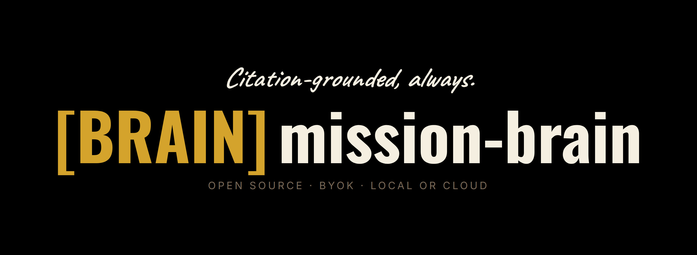

# mission-brain



A retrieval-only second brain over your own writing. Returns cited
passages from your corpus. Never generates text without a marker
back to what you actually wrote.

## What it does

Drop your writing into `corpus/`, configure your `.env` for whichever
providers you want, run `mission-brain ingest` to build a queryable
wiki, then `mission-brain query` to pull citation-grounded results
back out.

Every paragraph in a response includes a `[ref:source_id:locator]`
marker pointing at the exact passage in your corpus. Output without
markers fails validation and never reaches your vault.

## Privacy posture

Your corpus stays on disk. mission-brain never uploads source text
in bulk. Embeddings hit Voyage only when you provide your own Voyage
API key. Synthesis hits Anthropic only when you provide your own
Anthropic API key. The Ollama path runs fully local; nothing leaves
your machine on that path.

Default config picks the most private mode (Ollama for both
embeddings and synthesis). Cloud providers stay opt-in through API
keys; mission-brain never infers them from system state.

## Quickstart

```bash
git clone https://github.com/<your-username>/mission-brain.git
cd mission-brain
cp .env.example .env  # configure providers
# drop your writing into corpus/
mission-brain ingest
mission-brain query "what have I written about X?"
```

## What sets it apart

- **Retrieval-only.** Returns cited passages. You compose the final
  draft. Other RAG tools generate text on your behalf; mission-brain
  doesn't.
- **Citation-mandatory.** Every passage carries a
  `[ref:source_id:locator]` marker. Output without markers fails
  validation and never reaches your vault.
- **Voice-preserving.** The synthesis prompts work to keep your
  phrasing intact. Retrieved passages travel with their original
  tone.
- **Self-hosted, vendor-portable.** Your data lives in plain
  markdown plus LanceDB. Move it to a different tool whenever you
  want.

## Stack

- Python 3.12+
- pydantic, typer, llama-index, lancedb, python-frontmatter
- Voyage (cloud embeddings, optional) / Ollama (local embeddings)
- Anthropic / OpenRouter / Ollama for synthesis
- pytest for tests

## Sibling tools

Three other open-source tools share this repo's posture: your data
on your disk, your keys for paid providers, no SaaS layer.

- **[GeneralStaff](https://github.com/lerugray/generalstaff)**:
  multi-project bot orchestrator with hands-off enforcement and
  audit logging.
- **[mission-bullet-oss](https://github.com/lerugray/mission-bullet-oss)**:
  AI-assisted bullet journal for daily capture and weekly review.
  Companion for "what am I thinking right now" while mission-brain
  handles "what have I written about X."
- **[mission-swarm](https://github.com/lerugray/mission-swarm)**:
  swarm-simulation engine that generates plausible audience
  reactions to a document. Useful for rehearsing how a draft might
  land before you publish it.

## License

[AGPL-3.0-or-later](LICENSE).
